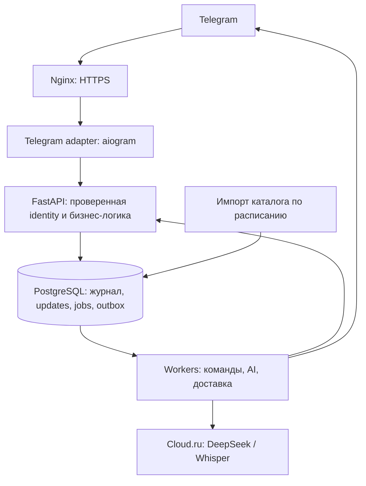

# ТЗ: публичный многопользовательский Climbing Journal

Дата: 6 октября 2026. Обновлено: 10 октября 2026.
Статус: проект ТЗ, реализация не начата.
Согласованный масштаб: 10 000 зарегистрированных пользователей,
1 000 активных пользователей в день.

## 1. Цель и границы

Любой человек может открыть Telegram-бота и подать заявку на доступ.
Владелец сервиса получает её в своём личном Telegram-чате и подтверждает
или отклоняет. Вести журнал и смотреть статистику можно после подтверждения.
Аккаунт создаётся автоматически; ручное редактирование allowlist не требуется.
История, статистика, заметки, снаряжение и тестовый режим доступны только владельцу.
Подача заявки открыта всем. Одобрение даёт доступ только к собственным данным.

Первый публичный релиз включает личные чаты Telegram, текст, голосовые сообщения,
кнопки журнала, статистику, профиль, экспорт и удаление аккаунта. Группы,
совместные тренировки, публичные профили, платежи, веб-приложение и мобильное
приложение находятся за пределами этого релиза.

Сохранить существующую логику тренировок и статистики: независимые reachedTop и
cleanAscent, style и belay, исторические снимки маршрутов, порядок категорий
6B < 6B/6B+ < 6B+, исключение тестовых данных по умолчанию.
Срыв или зависание исключают чистый пролаз даже при указанном flash/onsight/redpoint.

## 2. Исходное состояние и необходимые изменения

В версии 0.7.0 уже есть PostgreSQL, аккаунты с Telegram-привязкой, короткоживущие
Bearer-сессии, проверки владельцев тренировок, изоляция статистики и idempotency.
Профиль доступен через API и команды бота. Это основание для следующей версии.

Сейчас публичному запуску мешают:

- Telegram-вход и интерфейс работают через OpenClaw и списки допуска.
- Публичный HTTP-контракт неполный; часть операций доступна только через tools.
- Каталог локаций, секторов и трасс общий, в том числе для ручных записей.
- Нет собственной надёжной обработки Telegram updates, очередей и контроля затрат.
- Экспорт и удаление через API не охватывают переписку, аудио и резервные копии.
- API запускается с ролью PostgreSQL, которую нужно отделить от владельца схемы
  и роли миграций перед применением защиты строк.

Публичный релиз требует выполнения критериев приёмки ниже. Открытие allowlist
существующего Gateway не считается реализацией этого ТЗ.

## 3. Архитектура

Реализовать модульный backend на Python. Разделять процессы для нагрузки,
сохраняя одну реализацию бизнес-логики и один источник данных — PostgreSQL.



Процессы Docker Compose:

| Сервис | Ответственность |
| --- | --- |
| nginx | HTTPS, маршрутизация, ограничения размера и частоты HTTP-запросов |
| bot | Webhook, проверка Telegram update, роутеры aiogram, меню и formatter |
| api | Авторизация, профиль, тренировки, каталог, статистика, лимиты |
| worker-fast | Короткие команды и формирование ответов без LLM |
| worker-ai | Транскрибация и распознавание намерений |
| worker-delivery | Доставка ответов из outbox с учётом ограничений Telegram |
| postgres | Основные данные, очередь заданий, история запусков |

Workers используют типизированные внутренние команды API с идентификатором
задания. API получает владельца из сохранённого задания, а не из результата LLM.
Worker не имеет права выбирать произвольный userId для пользовательской операции.
Перезапуск worker не должен обрывать данные или терять задание.

OpenClaw вывести из пути публичных пользовательских сообщений. При необходимости
оставить отдельным инструментом оператора, без доступа пользователей бота.
Не переносить его общую память, workspace и административные команды в новый бот.

На первом этапе очереди хранить в PostgreSQL: jobs с lease, heartbeat worker,
available_at и выборкой FOR UPDATE SKIP LOCKED. Внешние вызовы выполняются вне
транзакции БД. Redis или отдельный брокер добавлять после измерения узкого места;
потеря кеша не должна приводить к потере журнала или заданий.
Kubernetes для первого публичного запуска не требуется.

## 4. Регистрация, авторизация и роли

1. /start создаёт аккаунт pending_approval по Telegram from.id из проверенного
   личного update и предлагает кнопку «Запросить доступ».
2. Нажатие сохраняет заявку и уведомление владельцу. Пользователь видит
   «Заявка отправлена. Доступ появится после подтверждения».
3. Повторный /start возвращает текущий статус. Имя и username не являются
   идентификаторами и не объединяют пользователей. Повторная кнопка при
   ожидающей заявке не создаёт новую заявку или повторное уведомление.
4. После одобрения статус становится active, пользователь получает уведомление,
   главное меню, профиль и пустую собственную статистику.
   Часовой пояс по умолчанию Europe/Moscow, с явной возможностью изменить его.
5. Перед первым AI/voice-запросом показать краткое уведомление о внешней обработке
   текста и аудио и сохранить подтверждение с версией уведомления.
6. До одобрения доступны только старт, статус заявки, справка и информация
   о личных данных. Команды журнала, статистика и AI/voice-задания закрыты.
   Проверка статуса обязательна в API и workers, а не только в меню.
7. После отказа пользователь видит решение и остаётся без доступа. Повторную
   заявку разрешать после настраиваемого интервала, исходно 24 часа.
   Аккаунт blocked не может восстановить доступ новой заявкой.

### Подтверждение в чате владельца

Бот отправляет владельцу карточку: номер и время заявки, Telegram ID,
имя и username при наличии, кнопки «✅ Разрешить» и «❌ Отказать».
Карточка не содержит личных записей или текстов сообщений заявителя.
Получатель задаётся проверенными ACCESS_APPROVAL_CHAT_ID и
ACCESS_APPROVER_TELEGRAM_ID; ID владельца нельзя угадывать по прежнему allowlist.
Если чат подтверждения не настроен или доставка не удалась, заявка остаётся
ожидающей; автоматическое одобрение запрещено.

Заявка хранит user_id, статус pending/approved/rejected, created_at,
decided_at и decided_by. На пользователя допускается одна ожидающая заявка.
Статусы аккаунта: pending_approval, active, blocked; миграция должна обновить
ограничение users.status, которое в 0.7.0 допускает только active/blocked.

Callback обрабатывается без LLM. Сервер проверяет отправителя-владельца,
его административные права, чат карточки, одноразовое подтверждение и
текущий статус заявки. Чужая или пересланная кнопка не предоставляет прав.
Одобрение/отказ, смена статуса и outbox-уведомление фиксируются атомарно.
Повторное нажатие безопасно; из двух конкурирующих решений применяется одно.
Решение записывается в аудит с ID владельца, заявкой и временем.
Старая заявка не может активировать заблокированный или удалённый аккаунт.

Заявки доступны владельцу также через список с пагинацией в его чате.
При всплеске регистраций уведомления группируются с переходом к списку;
очередь заявок хранится в PostgreSQL и переживает перезапуск.
Автоматическое и массовое одобрение в первый релиз не входят.

Роли: user, support, admin. Статус аккаунта и роль — разные понятия.
Роль нового пользователя всегда user. Привилегированную роль назначает оператор
сервера после проверки Telegram ID; доступ к журналу не делает человека владельцем.
Нельзя назначать права по имени, username, тексту сообщения или первому входу.

Webhook проверяет X-Telegram-Bot-Api-Secret-Token до обработки тела. Endpoint
доступен только по HTTPS. Допуск пользователя определяется по Telegram from.id,
а не по пересланному сообщению, callback_data, указанному userId или chat_id
из произвольного запроса. В первом релизе принимать только личные чаты.
Механизм webhook secret описан в [Telegram Bot API](https://core.telegram.org/bots/api#setwebhook).

Внутренний Telegram bootstrap с сервисным ключом остаётся закрытым для интернета.
Сервисные ключи bot/worker/importer имеют раздельные права и ротацию.
Пользовательские API-операции требуют проверенную пользовательскую сессию.
Вход для будущего браузерного клиента проектировать отдельно; переданный
клиентом Telegram ID не является доказательством авторизации.

## 5. Данные и изоляция

Сохранить существующие внутренние ID, Telegram external_refs и принадлежность
записей. Не создавать новый аккаунт существующему человеку при смене адаптера.

| Данные | Владение / доступ |
| --- | --- |
| users, профиль, настройки, согласия | Сам пользователь; минимальные права поддержки |
| access_requests | Заявитель видит свой статус; решение принимает только владелец сервиса |
| auth_sessions | Только сервер; хранить хеши токенов и срок действия |
| training_sessions | user_id, доступ только владельцу |
| route_attempts, training_gear | Владелец через тренировку; чужие связи запрещены |
| gear | user_id, доступ только владельцу |
| ручные locations/sections/routes | Приватный каталог создавшего пользователя |
| проверенный каталог источников | Общедоступный для чтения; запись только импортеру/модератору |
| updates, jobs, диалоги, контекст | user_id и Telegram identity исходного события |
| outbox, media | user_id; адрес доставки связан с владельцем |
| usage_events, quotas | Пользователь и операция; без текста заметок |

Для каталога добавить owner_id и visibility либо эквивалентную явную модель
владения. Приватность должна распространяться на всю цепочку район → сектор →
маршрут. Общий маршрут не может ссылаться на чужой приватный сектор.
Поиск возвращает общий каталог и собственные приватные записи.
Обычный пользователь не редактирует общий объект и не присваивает ему AllClimb ID.
Каталожные external_refs источника добавляет только доверенный импорт.

Одинаковые названия районов в разных странах или регионах не объединять.
При миграции ручных объектов проверить владельцев использующих их тренировок.
Неоднозначные и используемые несколькими людьми объекты разобрать отдельно;
не публиковать их автоматически и не менять исторические route snapshots.

Проверки владельца обязательны в сервисах и запросах, включая статистику,
summary, поиск, callbacks, фоновые задания, экспорт, кеши и удаление.
Чужой ID ресурса возвращает 404. Ключ кеша включает владельца и фильтры.

Ввести PostgreSQL Row-Level Security для приватных таблиц как дополнительную
защиту от пропущенного фильтра. Runtime-роли не должны быть superuser,
владельцем таблиц или иметь BYPASSRLS. Роль миграций отдельная.
Устанавливать app.user_id через SET LOCAL внутри каждой транзакции; отсутствие
контекста запрещает доступ, а повторное использование соединения не переносит
пользователя. RLS для дочерних сущностей проверяет владельца родительской записи.
Проверять также фоновые процессы и права записи в общий каталог.
Поведение владельцев и BYPASSRLS описано в
[PostgreSQL 17: Row Security](https://www.postgresql.org/docs/17/ddl-rowsecurity.html).

## 6. Telegram UI и статистика

Главное меню: начать/завершить тренировку в зависимости от её состояния,
текущая тренировка, пройденные трассы, статистика, профиль, тестовый режим.
Меню не должно показывать фиктивное отсутствие тренировки при ошибке API.
Добавить /help, /privacy, экспорт и удаление аккаунта с подтверждением.
Публичные меню не содержат команд OpenClaw или администрирования.

Статистика: текущая и последняя тренировка, все попытки, неделя, месяц,
прогресс, категории, локации, проекты и рекорды. Начало недели — понедельник;
границы периодов определяются timezone пользователя. Тестовые данные
исключаются по умолчанию и показываются только при явном выборе.

Два входа в одну реализацию:

```text
Кнопка → проверенный callback → API → StatisticsService → DTO → formatter
Текст → LLM извлекает scope/filters → тот же API → тот же formatter
```

Кнопки, профиль и просмотр журнала: 0 LLM-вызовов.
Свободный запрос статистики: не более 1 вызова распознавания намерения.
Второй вызов для форматирования запрещён.
Пустая статистика означает отсутствие собственных данных, а не отказ доступа.

Callback содержит действие и короткий идентификатор, но не предоставляет права.
Проверять владельца ресурса, актуальность сообщения, срок подтверждения и
принадлежность приватного сообщения отправителю. Устаревшая кнопка предлагает
обновить экран. FSM и черновики разделены по пользователю и чату.
Роутеры и webhook реализовать на [aiogram](https://docs.aiogram.dev/en/latest/dispatcher/webhook.html).

## 7. Текст, голос и LLM

Cloud.ru — текущий основной провайдер. Сохранить возможность использовать
DeepSeek-V4-Flash для намерений и whisper-large-v3 для транскрибации,
если эти модели доступны в аккаунте на момент реализации. Имена моделей,
лимиты и адреса API задаются конфигурацией адаптера.

LLM возвращает только DTO намерения/фактов. Backend проверяет схему,
категории, ссылки, переходы состояний и инварианты пролаза. Пользовательский
текст не может менять account, права, адрес доставки или выполнять код.
Не предоставлять модели shell, файловую систему, SQL, произвольные HTTP-запросы
или доступ к чужим диалогам. Выбор следующего действия ограничен явными командами.

Контекст: текущая тренировка и необходимые собственные последние события,
с жёстким бюджетом токенов. Не передавать всю историю или каталог.
Для новой попытки учитывать продолжение текущей трассы и отделять новую
попытку от исправления существующей. Неоднозначность вызывает уточнение,
а не добавление предполагаемой записи.

Голос: проверить длительность/размер → получить файл → ASR → показать текст
при необходимости → распознать намерение → валидировать → сохранить.
Успех подтверждается после commit. При отсутствии активной тренировки
предложить её начать, не присоединять запись к последней завершённой.

LLM/ASR не должны задерживать кнопки статистики или другого пользователя.
При недоступности провайдера остаются доступными детерминированные экраны,
формы и ручной ввод. Не отправлять данные резервному внешнему провайдеру
без соответствующего уведомления и настройки пользователя.

## 8. Очереди, порядок и надёжность

Перед ответом 2xx на webhook сохранить update и задание в одной транзакции.
Если сохранение не удалось, вернуть ошибку, а не подтверждать потерянный update.
Дедупликация по (bot_id, update_id); изменяющие команды имеют дополнительный
Idempotency-Key, ограниченный пользователем и операцией.

Состояния задания: pending, processing, succeeded, failed, cancelled.
Поля: user_id, исходное событие, тип, sequence, training_id, expected_version,
attempt_count, available_at, lease_until, worker_id, last_error_code.
Истёкший lease возвращает работу в очередь. Не держать блокировку тренировки
во время ASR/LLM-запроса. После внешнего ответа повторно проверить статус
аккаунта, целевую тренировку и право применить результат.

Изменения журнала одного человека применяются в порядке его событий; чтение
статистики не ждёт длинную AI-очередь. Завершение тренировки при незавершённом
разборе попытки показывает ожидание и вариант отменить ожидающую запись.
Результат старого задания не переносится автоматически в новую тренировку.

Commit изменения и создание outbox выполняются атомарно. Доставка ответа
повторяется отдельно от записи попытки. Не обещать exactly-once доставку сообщения:
при неясном сетевом результате Telegram sendMessage дубль уведомления возможен,
но дубль записи в журнале недопустим.

Ограничить повторные попытки и длительность задания; временные ошибки повторять
с backoff, постоянные ошибки валидирования не повторять. Учитывать Retry-After
провайдеров и Telegram. Ошибка или исчерпанный лимит дают понятное уведомление.
Ограничения отправки описаны в [Telegram Bots FAQ](https://core.telegram.org/bots/faq#my-bot-is-hitting-limits-how-do-i-avoid-this).

## 9. Нагрузка и стоимость

10 000 регистраций и 1 000 DAU — согласованная цель. Следующие величины являются
предварительным профилем нагрузочного теста, а не измеренной возможностью сервера:

| Показатель | Цель первого публичного релиза |
| --- | --- |
| Одновременно активные пользователи | 100 |
| API: чтение/короткие изменения | 20 запросов/с в течение 30 минут |
| Краткий всплеск входящих updates | 50/с в течение 60 секунд, без потери |
| Данные для проверки запросов | 100 000 тренировок и 1 000 000 попыток |
| Webhook: подтверждение сохранённого события | p95 до 1 секунды |
| API: собственная статистика, без сети Telegram | p95 до 500 мс |
| Кнопка → готовый ответ в outbox, обычная нагрузка | p95 до 2 секунд |
| AI/voice | Сроки отдельно измеряются вместе с провайдером; UI показывает очередь |

В тестах нагрузка распределена между пользователями; проверить также длинную
историю одного пользователя, конкурирующие записи и шумного клиента.
Задать таймауты, размеры пулов БД и максимальное число параллельных AI/ASR-запросов.
Масштабировать API и workers независимо. PostgreSQL оптимизировать по планам
запросов и индексам; заранее не вводить отдельную БД на каждого пользователя.

Начальные настраиваемые ограничения: до 20 AI-запросов в день на пользователя,
10 минут аудио в день, 2 минуты на файл; максимум 3 ожидающих AI-задания
на пользователя. Обычная статистика не расходует AI-квоту. Конкретный денежный
бюджет сервиса и глобальная параллельность утверждаются перед запуском.

Перед вызовом зарезервировать квоту, после завершения учесть реальные токены,
аудиосекунды и результат операции. Ошибки и неоднозначные сетевые ответы
не должны позволять неограниченные повторные платные вызовы. Счётчики и
резервирование атомарны между workers. На исчерпанный бюджет — отказ AI с
сохранением доступа к журналу. Хранить usage, не полные тексты сообщений в логах.

## 10. Личные данные, администрирование и эксплуатация

Экспорт включает профиль, тренировки, попытки, снаряжение и приватный каталог,
включая тестовые данные. Большой экспорт — фоновое задание с доставкой только
в личный чат владельца. Файл экспорта автоматически удаляется через 24 часа.

Удаление требует явного подтверждения владельца. После подтверждения блокировать
новые операции, отзывать сессии, отменять задания и доставку, удалять личные
таблицы, медиа, черновики и диалоги. Историю общего каталога не удалять вместе
с человеком. Учитывать удержание данных внешним провайдером отдельно.

Предлагаемые сроки: исходное аудио — до 24 часов после обработки; update и
транскрипт — до 7 дней; технические журналы и usage — до 30 дней;
резервные копии — до 30 дней. Это настройки проекта, подлежащие утверждению
перед запуском, а не утверждение о сроках хранения у Telegram/Cloud.ru.
После удаления аккаунта технические usage-записи не должны сохранять лишнюю
привязку к человеку. При восстановлении backup повторно применять удаления;
минимальный реестр удалений хранить отдельно от восстанавливаемого снимка.

Минимальная админка/API: заявки на доступ и решения владельца, число
пользователей, состояние очередей, блокировка,
квоты и обезличенные ошибки. Доступ поддержки к чужим заметкам не выдавать
по умолчанию. Привилегированные действия журналировать отдельно.
Секреты и raw сообщения не должны попадать в метрики или error traces.

Наблюдаемость: request_id/update_id/job_id, возраст очереди, retries, failed jobs,
p95 API, доставка, ошибки провайдеров, стоимость, пул БД, свободное место,
возраст backup. Настроить алерты по измеримым порогам. /health — процесс жив,
/ready — обязательные зависимости готовы; отказ AI не делает статистику недоступной.

Перед публичным запуском проверить pg_dump/restore в отдельной среде.
Для первого развёртывания цели восстановления: RPO до 24 часов, RTO до 4 часов.
Один сервер — первоначальный вариант, без обещания высокой доступности;
параметры машины выбираются после нагрузочного теста. Внешняя защищённая
копия backup обязательна, тот же сервер не является достаточным резервом.
Все компоненты запускаются Docker Compose из Git с закреплёнными версиями,
runbook обновления и отката. Миграции применяет отдельный процесс/роль один раз.

## 11. API и импорт каталога

Выделить TrainingService, StatisticsService, CatalogService, ProfileService,
AuthService и JobService. Сохранить одну реализацию правил для кнопок, текста
и будущих клиентов. Добавить типизированные REST-схемы и OpenAPI.

Основные группы /api/v1: me, auth, trainings, attempts, gear, catalog,
statistics, exports, account-deletion. Для списков — cursor pagination,
явные фильтры и максимальный размер страницы. PATCH обновляет только переданные
поля. Конфликты версии/повтора возвращают 409; лимит — 429; чужой ресурс — 404.
Endpoint /tools оставить внутренним совместимым адаптером на время перехода,
не давать ему более широкие права, чем типизированным пользовательским операциям.

Сохранить требование отдельного еженедельного импорта AllClimb для России
и Турции. Плановое время — понедельник 04:00 Europe/Moscow. Доступ к полному
источнику — самостоятельная зависимость: состояние описано в
[allclimb-import.md](allclimb-import.md). Публичный запуск журнала не требует
обхода ограничений источника и не зависит от готовности этого импорта.
Импортер не имеет прав на личные таблицы и не меняет исторические попытки.

## 12. Порядок перехода

1. Разделить приватный/публичный каталог, роли БД, RLS и сервисы; проверить
   существующие ID, Telegram-привязки, snapshots и агрегаты после миграции.
2. Сделать typed API и детерминированный Telegram UI на отдельном тестовом боте.
   Проверить заявки двух новых людей, одобрение в чате владельца и сохранение
   существующего аккаунта. До миграции владелец явно подтверждает список
   существующих пользователей с доступом; остальные получают pending_approval
   с сохранением истории. Наличие старой записи users само по себе не даёт допуск.
3. Добавить durable updates, jobs, outbox, порядок изменений и восстановление
   после перезапуска. Затем перенести voice/LLM и квоты.
4. Завершить экспорт/удаление, администрирование, backup и наблюдаемость.
5. Выполнить проверки приёмки и нагрузочный тест; провести ограниченную бету.
6. Сохранить backup и остановить OpenClaw polling рабочего Telegram-токена.
   Подключить webhook нового адаптера, сохранив pending updates; не применять
   drop_pending_updates без отдельного решения. Убедиться, что сообщения принимает
   только одна рабочая система, а повторный update не создаёт дублей.
7. Открыть подачу заявок без allowlist после проверки. Доступ к журналу
   включается только решением владельца. При откате сначала
   остановить новый приём и обработку изменений, сохранив уже принятые задания.
   После публичного запуска откатывать на совместимую версию нового сервиса
   либо включать режим обслуживания. Возврат к OpenClaw допустим только до
   публичного запуска и с прежним закрытым допуском; он не обслуживает публичную
   базу пользователей. Не восстанавливать старую БД поверх новых записей.

## 13. Критерии приёмки публичного запуска

- Любой новый Telegram-пользователь может открыть /start и подать заявку.
  До одобрения он не ведёт журнал, не читает статистику и не вызывает AI/ASR
  через команды, callbacks или прямой API.
- Заявка приходит в настроенный личный чат владельца. Только проверенный
  владелец может разрешить или отклонить её; после одобрения доступны /journal,
  тренировки и собственная статистика без ручной правки серверного allowlist.
- Повтор заявки/update/нажатия не создаёт дубликаты; пересланные и чужие кнопки
  не дают доступ. Ошибка доставки, перезапуск и два одновременных решения
  не приводят к потере заявки или автоматическому одобрению.
- Два разных Telegram ID с одинаковыми именами получают разные аккаунты;
  существующий человек сохраняет ID и историю после переключения адаптера.
- A не читает, не меняет и не удаляет данные B через ID, фильтры, callbacks,
  summary, exports, каталог, задания или результаты LLM.
- Те же проверки проходят напрямую под runtime-ролью БД; отсутствующий
  и сменившийся пользовательский контекст не открывают чужие строки.
- Новый пользователь не получает административных прав и не может вызвать
  файловые/системные инструменты или выбрать произвольного получателя сообщения.
- Приватный ручной маршрут A не виден B. Публичный каталог доступен обоим,
  но обычный пользователь не редактирует его и не присваивает source ID.
- Статистика по кнопкам вызывает LLM 0 раз; свободный запрос — максимум 1 раз.
  Выключенный провайдер не ломает кнопки и ручные формы.
- Повтор update, падение worker после commit и ошибка отправки ответа
  не создают повторную попытку. Два разных сообщения сохраняют два события.
- Два одновременных старта оставляют одну активную тренировку; запоздавший
  разбор попытки не попадает в другую тренировку после завершения/переключения.
- Срывы/зависания исключают чистый пролаз; категории, belay, style, проекты,
  тестовые данные и timezone совпадают с согласованными правилами журнала.
- При перегрузке есть очередь/понятный отказ, бюджет соблюдается и шумный
  пользователь не блокирует остальных. Выполнены цели нагрузочного теста.
- Экспорт и удаление доступны владельцу из Telegram; после удаления нет
  новых записей от ранее запущенных jobs, а восстановление учитывает удаления.
- Пройдена репетиция миграции и отката без потери существующих тренировок.

Тесты сосредоточить на этих границах: изоляция, дедупликация, порядок,
лимиты и восстановление. Не расширять набор за счёт проверок, повторяющих код.

## 14. Решения перед реализацией

Масштаб согласован. До открытия публичного доступа определить оператора с
проверенным Telegram ID и его личный чат для подтверждений, денежный бюджет AI,
окончательные квоты и сроки
хранения, домен webhook, конфигурацию сервера по результату замеров и доступ
к источнику каталога. Эти параметры не должны блокировать разработку модулей,
но их нельзя подменять догадкой в production.
